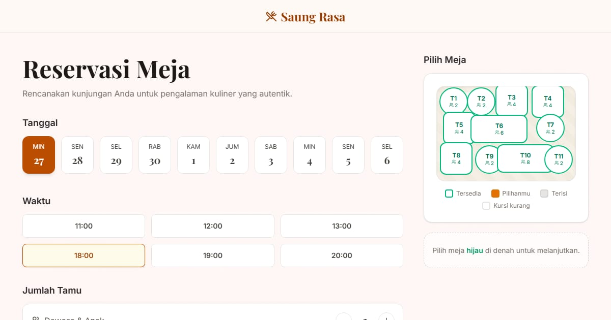

# Pawon Lirih — Pesan meja lewat denah

Restoran masakan rumahan Jawa (fiktif) di Yogyakarta. Paradigma **denah meja**: pilih hari, jam, dan jumlah tamu, lalu klik meja yang masih kosong langsung di denah.

**Demo live:** https://reservasi-restoran-gilt.vercel.app



> Purwarupa desain. Nama usaha, data, dan harga fiktif. Tidak ada pembayaran dan tidak ada yang dikirim ke server: pemesanan disimpan di `localStorage` peramban. Tanggal dan jam dihitung dalam WIB di peramban; keterisian contoh dibuat stabil per tanggal.

## Fitur

- Kartu 10 hari ke depan dalam WIB; Senin tutup, jam yang tinggal kurang dari 30 menit tidak bisa dipesan.
- Meja punya zona (dekat jendela, pojok tenang, dekat dapur) dan kapasitas; meja yang terlalu kecil otomatis nonaktif.
- `/menu` — menu Jawa lengkap dengan tanda pedas, vegetarian, kacang.
- `/rombongan` — 10–30 orang: pilih paket, perkiraan biaya dengan pajak restoran 10% dan uang muka 30%.
- `/reservasi` — reservasi saya: akan datang & sudah lewat, batalkan.

## Halaman

`/` · `/menu` · `/reservasi` · `/rombongan`

## Teknologi

- Next.js 15.5 (App Router) dan React 19
- Tailwind CSS v4
- JavaScript
- Framer Motion, Lucide (ikon)
- Font: Playfair Display, Inter (next/font)
- SEO: metadata per halaman, Open Graph, sitemap.xml, dan robots.txt

## Menjalankan secara lokal

```bash
npm install
npm run dev
```

Buka http://localhost:3000. Untuk build produksi: `npm run build` lalu `npm start`.

---

Bagian dari koleksi 5 aplikasi reservasi di [PortalReservasi](https://www.pintuweb.com/website-reservasi). Dibuat oleh [PintuWeb](https://www.pintuweb.com), jasa pembuatan website.
